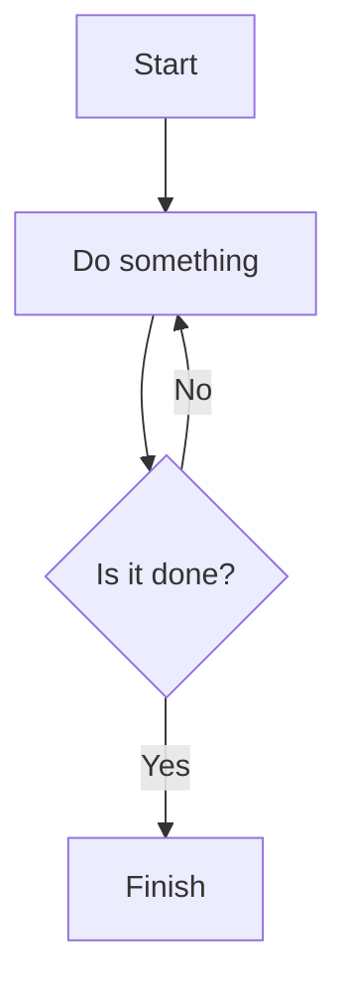

# Diacter 

Bienvenue dans la documentation complète du projet **Nom du Projet**.

## Introduction

Ce projet vise à [insérer objectif principal]. Développé en utilisant des technologies modernes comme **[technologies utilisées]**, il présente diverses fonctionnalités uniques.

## Image

Voici une capture d'écran de l'application :


## Vidéo

Tu peux également intégrer des vidéos pour illustrer le fonctionnement :

<iframe width="560" height="315" src="https://www.youtube.com/embed/dQw4w9WgXcQ" frameborder="0" allowfullscreen></iframe>

## Citation

Intègre des citations ou des remarques importantes :

> "Ce projet est un excellent exemple de la façon dont les technologies modernes peuvent être utilisées pour résoudre des problèmes complexes." – **Léonard Corre**

## Exemple de Code

Tu peux afficher des blocs de code comme suit :

```js
// Exemple de code en JavaScript
const express = require('express');
const app = express();

app.get('/', (req, res) => {
  res.send('Hello World!');
});

app.listen(3000, () => {
  console.log('Serveur démarré sur le port 3000');
});
```

### Intégration TypeScript

```ts
// Exemple de code TypeScript
type Project = {
  name: string;
  description: string;
};

const myProject: Project = {
  name: "Nom du Projet",
  description: "Ceci est un projet d'exemple en TypeScript"
};

console.log(myProject);
```

## Tableaux

Les tableaux peuvent être utilisés pour structurer des données :

| Fonctionnalité | Description                  | Statut       |
| -------------- | ---------------------------- | ------------ |
| Authentification | Implémentation d'une auth sécurisée | En cours     |
| API REST       | Développement de l'API en Node.js | Complété     |
| Interface      | UI en React et Next.js        | Complété     |

## Alertes

Tu peux ajouter des alertes pour attirer l'attention :

::: warning Attention
Ce projet est encore en cours de développement. Certaines fonctionnalités peuvent être instables.
:::

::: tip Conseil
Utilise Docker pour une meilleure gestion des environnements.
:::

## Liens Externes

Ajoute des liens vers d'autres ressources ou documentation :

[Consultez la documentation officielle de VitePress](https://vitepress.dev/)

## Liste à Puces

- **Backend** : NestJS, Express
- **Frontend** : React, Next.js
- **DevOps** : Docker, Kubernetes, GitlabCI
- **Cloud** : AWS, S3

## Liste Numérotée

1. Analyse du problème
2. Conception de l'architecture
3. Développement et tests
4. Mise en production

## Graphique ou Diagramme

Tu peux aussi intégrer des diagrammes (via Mermaid, par exemple) :



## Fonctionnalités

Voici une liste des principales fonctionnalités développées dans ce projet :

- **Fonctionnalité 1** : Développement de l'API REST pour la gestion des utilisateurs.
- **Fonctionnalité 2** : Interface utilisateur développée avec React.
- **Fonctionnalité 3** : Intégration de l'authentification OAuth2 pour les utilisateurs.
- **Fonctionnalité 4** : CI/CD avec GitLabCI et déploiement sur AWS.

## Technologies Utilisées

Ce projet utilise les technologies suivantes :

- **Node.js** pour le backend.
- **React** pour le frontend.
- **AWS** pour le déploiement.
- **Docker** pour la conteneurisation des services.

## Conclusion

Ce projet est un excellent exemple de l'intégration de multiples technologies pour répondre à des besoins spécifiques. Pour plus d'informations, consulte le [repository GitHub du projet](https://github.com/ton-projet).

```

### Explication des sections :
1. **Introduction** : Résume le projet, ses objectifs, et les technologies utilisées.
2. **Image** : Intégration d’images avec une description claire.
3. **Vidéo** : Ajout de vidéos via un lien `iframe`.
4. **Citation** : Exemples de citations pour des remarques ou réflexions importantes.
5. **Exemple de Code** : Affiche du code dans différents langages avec mise en forme.
6. **Tableaux** : Utilisation de tableaux pour structurer des données ou des fonctionnalités.
7. **Alertes** : Utilisation de blocs d’alerte pour souligner des points importants.
8. **Listes** : Exemples de listes à puces et numérotées.
9. **Graphiques/Diagrammes** : Utilisation de Mermaid pour intégrer des diagrammes.
10. **Fonctionnalités** : Liste des fonctionnalités clés du projet.
11. **Technologies Utilisées** : Détail des technologies employées.

### Utilisation :
Ce template peut être réutilisé pour chaque projet dans ton blog, en modifiant simplement les sections spécifiques à chaque projet. Cela te permettra de garder une documentation complète et bien organisée pour chaque projet.

Est-ce que ce modèle correspond à tes attentes ?
